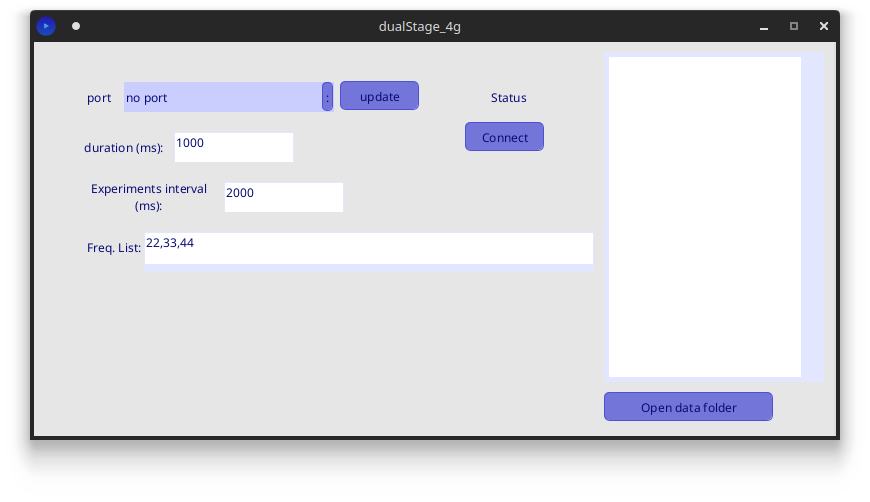

# dualstage_4g

software for vibrotactile stimulation.

## Features
* can vibrate using prestablished frequencies
* can use a list of frequencies, and automate a simple series of vibrations

## Requirements

For editing and compiling:
* Processing 4
    * Firmata
    * G4P controls
    * Serial

For running
* Java Runtime Environment (JRE) 17

